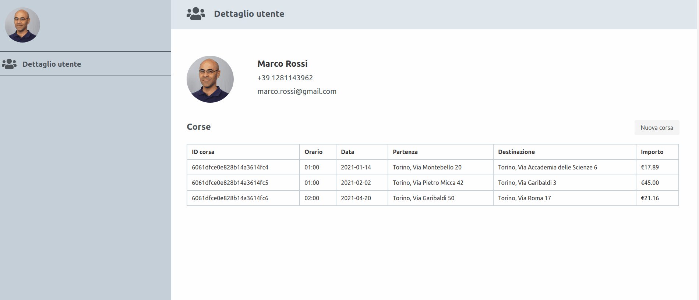
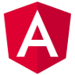

# MEAN App Boilerplate

An example of a simple app powered by the MEAN stack (MongoDB, Express.js, Angular, Node.js)

## Summary

* [Demo](#demo)
* [Stack](#stack)
* [Prerequisites](#prerequisites)
* [Getting started](#getting-started)

## Demo



## Stack





## Prerequisites

- Docker Compose >= 1.28

## Getting started

```bash
# Stop and remove running services (if there are)
docker-compose down -v --remove-orphans

# Start services
docker-compose up -d
```

After this you will have these services running:
- the Angular app at localhost:4200
- the Express backend at localhost:3000
- the MongoDB database
